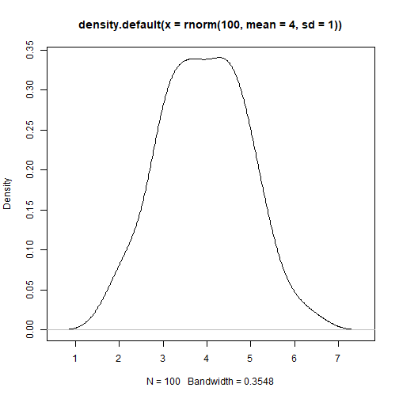

```r
# Using the native pipe ----
## A few examples ----

mtcars |>  
    subset(cyl == 6) |>
    head(10)
```

```
##                 mpg cyl  disp  hp drat    wt  qsec vs am gear carb
## Mazda RX4      21.0   6 160.0 110 3.90 2.620 16.46  0  1    4    4
## Mazda RX4 Wag  21.0   6 160.0 110 3.90 2.875 17.02  0  1    4    4
## Hornet 4 Drive 21.4   6 258.0 110 3.08 3.215 19.44  1  0    3    1
## Valiant        18.1   6 225.0 105 2.76 3.460 20.22  1  0    3    1
## Merc 280       19.2   6 167.6 123 3.92 3.440 18.30  1  0    4    4
## Merc 280C      17.8   6 167.6 123 3.92 3.440 18.90  1  0    4    4
## Ferrari Dino   19.7   6 145.0 175 3.62 2.770 15.50  0  1    5    6
```

```r
# Example from Jumping rivers post
# https://www.jumpingrivers.com/blog/new-features-r410-pipe-anonymous-functions/

rnorm(100, mean = 4, sd = 1) |>
    density() |>
    plot()
```



